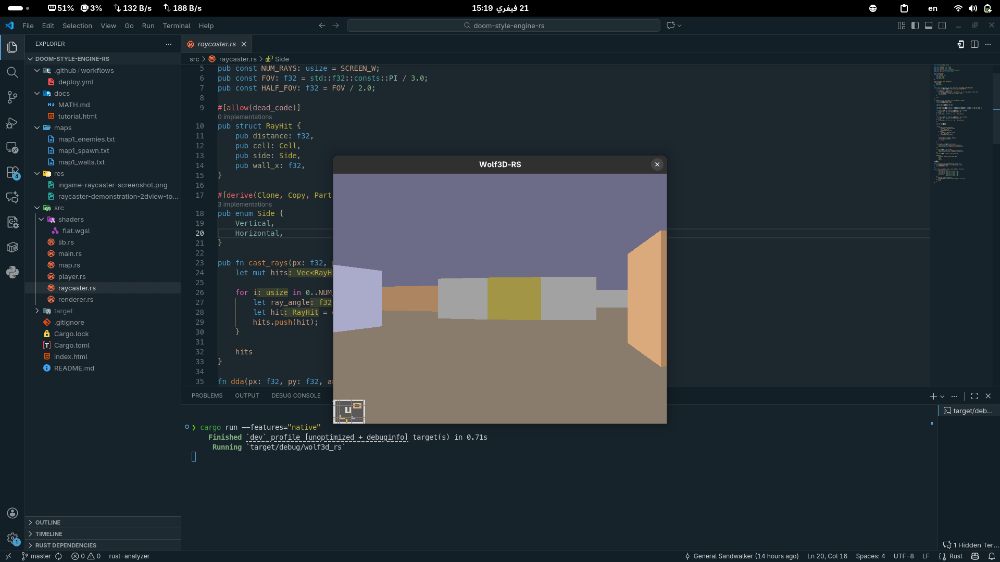
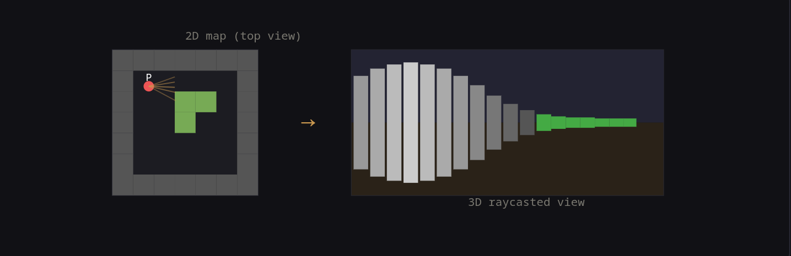

# doom-style-engine-rs

A hobby Wolfenstein-3D style raycasting engine written in Rust, using **wgpu** for GPU rendering and **winit** for windowing. Runs natively on desktop and in the browser via WebAssembly + WebGL2.



## How it works

The engine uses a classic **DDA raycasting** algorithm to project a 2D tile map into a pseudo-3D first-person view. A 2D minimap is rendered alongside the 3D view.



Maps are defined as plain text files under `maps/`:

```
# Wall map: 0=empty, 1=stone wall, 2=brick wall, 3=metal wall, 4=door
1 1 1 1 1 1 1 1 1 1 1 1 1 1 1 1
1 0 0 0 0 0 0 0 0 0 0 0 0 0 0 1
1 0 0 2 2 2 0 0 0 3 3 0 0 0 0 1
...
```

## Controls

| Key | Action |
|-----|--------|
| `W` / `↑` | Move forward |
| `S` / `↓` | Move backward |
| `A` / `←` | Turn left |
| `D` / `→` | Turn right |

## Building

### Desktop (native)

```sh
cargo run --features="native"
```

For an optimized release build:

```sh
cargo run --features="native" --release
```

**Requirements:** Rust toolchain, a GPU with Vulkan / Metal / DX12 support.

### Web (WebAssembly)

The web build is deployed automatically via GitHub Actions to GitHub Pages on every push to `master`.

To build locally:

```sh
wasm-pack build --target web --out-dir dist --release
# then serve the dist folder with any static file server, e.g.:
python3 -m http.server --directory dist
```

**Requirements:** [`wasm-pack`](https://rustwasm.github.io/wasm-pack/installer/), a browser with WebGL2 support.

## Tech stack

| | |
|---|---|
| Language | Rust |
| GPU API | [wgpu 27](https://github.com/gfx-rs/wgpu) |
| Windowing | [winit 0.30](https://github.com/rust-windowing/winit) |
| Web target | WebAssembly + WebGL2 via wasm-pack |
| Shader | WGSL flat-color |
| CI / Deploy | GitHub Actions → GitHub Pages |
